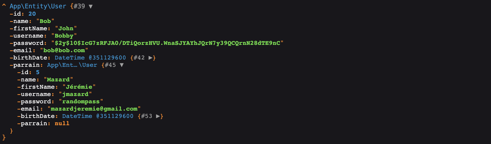

# Projet Annuel

## ToDo:

- replace all keys (=aliases) from within the container
- add dot notation to config class using the php dot notation package
- Route class should use a callable instead of 2 arguments

## Changelog

- Created a Config class for retrieving configuration values
- Allowed container services to be referenced by multiple aliases by passing an array to `set()` :

````php
$app->set(KernelInterface::class, $kernel)
// OR : 
$app->set([KernelInterface::class, 'kernel'], $kernel)
````

- Separated the bootstrapping of our applications into Bootstrappers extending Bootstrapper
- Extracted the `getMethodServiceParams()` method of the router into a `Container::make()` method that can be used
  anywere
- The make method is a way of resolving dependencies by injecting them from our IoC container into the class constructor

> Attention, cela a rendu notre container non conforme à psr-11. La méthode `get` devrait prendre l'implémentation de `make` pour être conforme. Ce n'est pas encore le cas pour des raisons de compatibilité. Du refactoring reste à faire.

Les service providers nous permettent, au lieu de faire ça:

````php
// index.php
$router = new Router($container, new ArgumentResolver());
$router->registerRoutes();
````

De créer un service provider puis de pouvoir récupérer le routeur depuis

````php
// RoutesServiceProvider.php
class RoutesServiceProvider extends ServiceProvider
{
    function register(): void
    {
        $this->app->set([Router::class, 'router'], Router::class);
    }
    
    function boot()
    {
        $router = $app->make('router');
        $router->registerRoutes();
    }
}
````

On a pu déplacer le chargement des variables d'environnement dans un bootstrapper.

Service providers : classes USED by our app Bootstrappers : service providers REQUIRED by our app

Séparer les service providers des bootstrappers permet de pouvoir réutiliser la code 'project-agnostic' sur un autre
projet à la manière d'un framework.

Pour améliorer le container:
Actuellement, le container stocke "en vrac" les services. Il instancie les classes en résolvant automatiquement et
récursivement les dépendances si le service est sous forme de FQCN. Il retourne simplement l'objet si il est stocké tel
quel. On pourrait gérer de la manière dont sont résolu nos services, notamment avec des singletons (ex pour le routeur),
ou avec une closure. Cela donnerait plus de flexibilité qu'actuellement.

````php
// Instead of this : 
$router->addRoute(new Route('/test-index', IndexController::class, "indextest"));

// Callable would allow us to register routes on the fly
$router->addRoute(new Route('/test-index', function() {
    return $this->view('index.html.twig')
} ));

// While somewhat preserving the original syntax:  
$router->addRoute(new Route('/test-index', [IndexController::class, "indextest"]));

````

### Hydratation des données :

Pour l'hydratation des données, on a créé un Hydrator implémentant HydratorInterface, qui est automatiquement injecté
dans tous les repositories par notre container. Il expose une méthode `hydrate(array $values, object $object)` qui,
appelée dans un repository, retourne l'objet hydraté.

Pour ce faire, il parcoure le tableau de `$values` et pour chaque valeur, trouve sa propriété et devine son setter.  
Avant d'appeler ce setter, il regarde si un attribut "Hydrator" existe sur la propriété.

Enfin, si aucun setter n'est trouvé et que l'attribut Hydrator n'est pas défini, l'hydrateur essaiera en dernier recours
de setter la propriété avec Réflection.

````php
class User
{
    // ...
    
    #[Hydrator(strategy: DateTimeStrategy::class)]
    private DateTime $birthDate;
    
    // ...
}
````

L'attribut Hydrator définit une stratégie. Chaque Stratégie est une classe implémentant
l'interface `App\Database\Hydration\Strategies\StrategyInterface`. Les stratégies exposent donc elles aussi et à coup
sûr, une méthode `hydrate()`.

Si l'attribut Hydrator est trouvé, l'hydrateur appellera la méthode `hydrate()` de la stratégie plutôt que le setter
qu'il a deviné.

L'implémentation suivante permet par exemple de setter la propriété birthdate de l'entité 'User' en retournant un
DateTime.

````php
class DateTimeStrategy implements StrategyInterface
{
    public function hydrate($value)
    {
        try {
            return new DateTime($value);
        } catch (Exception $e) {
            return new DateTime();
        }
    }
````

---

### Les stratégies sont automatiquement créés par le container, ce qui nous offre une grande flexibilité :

> **Par exemple:**   
> Pour instaurer un système de parrainage, on peut ajouter à la table 'user' de la bdd une colonne 'parrain' qui détient une clé étrangère vers l'id d'un autre utilisateur.
>
> On rajoute la propriété à notre Entité:
> ````php
> class User
> {
>     // ...
>     
>     #[Hydrator(strategy: UserStrategy::class)]
>     private ?User $parrain;
>     
>     // ...
> ````
>
> Et on créé la classe UserStrategy. Comme UserStrategy est instancié par le IoC container, ses dépendances sont automatiquement injectées.  
> On peut donc type-hinter le `UserRepository`, puis l'utiliser dans notre fonction hydrate pour retourner le parrain de l'utilisateur :
>
> ````php
> use App\Repository\UserRepository;
> 
> class UserStrategy implements StrategyInterface
> {
> 
>     private UserRepository $repository;
> 
>     public function __construct(UserRepository $repository)
>     {
>         $this->repository = $repository;
>     }
> 
>     public function hydrate($id)
>     {
>         return $id ? $this->repository->find($id) : null;
>     }
> }
> ````
>
> Lorsque l'on `dump()` un utilisateur ayant un parrain on obtient :
>
> 

À noter que cette façon d'hydrater fonctionne bien, mais "provoque" le problème n+1
Si l'on récupère 10 Users, on effectuera la requette principale avec le `findAll()` de l'AbstractRepository, + 10 autres requêtes pour récupérer les parrains. Soit n+1 requêtes.
Sur 10 users, cela reste négligeable, mais l'entité Event possède des références vers EventCategory, User, et Venue...

## Kernel, Response & PSR-7

Jusqu'à présent, notre application ne disposait que d'un objet Request que l'on pouvait manipuler pour récupérer les
informations de la requête entrante. La requête était passée à notre routeur qui se chargeait d'appeler le controlleur
associé, celui-ci appliquait sa logique, puis faisait un `echo` d'une template twig par exemple. Ce echo envoie
automatiquement les headers et le contenu de la page.

On a décidé de remplacer ce fonctionnement par un objet `Symfony\Component\HttpFoundation\Response` qui détient le
content, les headers, et le response code.
> /!\ Response de Symfony n'est pas compatible avec PSR-7. Il peut l'être à l'aide de [PSR-7 bridge](https://symfony.com/doc/current/components/psr7.html)

Le nouveau fonctionnement est le suivant:

1. La requête est créée puis passée au Kernel
2. Le Kernel crée un objet Response
3. Il appelle le routeur qui peut retourner soit une string, soit un objet Response
4. Le kernel renvoie un objet Response qui est envoyée avec la méthode `send()`

-> Les méthodes du routeur peuvent désormais `return` une template twig, ou une Response.

Par exemple:

````php
// IndexController.php

// exemple avec une template twig
#[Route(path: "/", httpMethod: "GET")]
public function index(Request $request)
{
  return $this->twig->render('index.html.twig', [
      'request' => $request
  ]);
}
  
// exemple avec un RedirectResponse
#[Route(path: "/", httpMethod: "GET")]
public function index()
{
    return new RedirectResponse('/contact');
}
````

### Le `route()` helper

Pour suivre l'exemple de Laravel (symfony aussi j'imagine), on a ajouté à Twig un helper `route()` qui pointe vers la
fonction `getRouteUriFromName` du routeur. On passe aussi notre routeur à Twig (ce qui n'est pas absolument nécessaire,
mais why not).

````php
// ViewServiceProvider.php
$twig->addGlobal('router', $router);
$twig->addFunction(new TwigFunction('route', fn(...$params) => $router->getRouteUriFromName(...$params)));
````

La fonction `getRouteUriFromName()` et donc `route()` dans le contexte de twig prend deux paramètres: le nom de la
route, puis un tableau associatif de valeurs.
`getRouteUriFromName` retrouvera la route, et remplira automatiquement l'uri avec les valeurs passées par exemple :

Ce qui nous permet de faire :

````php
// dans le contexte de php:
$router->route('user_edit', ['id' => 12]) // donnera '/user/edit/1'

// dans le contexte twig:
{{ route('user_edit', {'id': 12}) }} // donnera '/user/edit/1'
````
